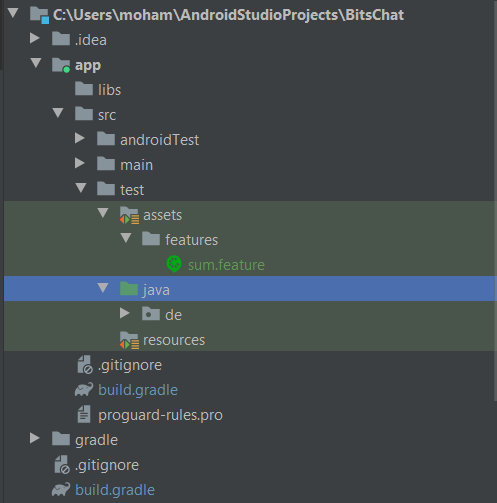

# Android Integration Testing using JVM

To start with, everyone nowadays are trying to go "Multi Platform", with a separation between the view layer and the logic layer being more and more expanded.

This causes some concerns when testing stuff. using a cross-platform brings a unique challenge. How can anyone be sure that the logic layer is working correctly across all these platforms?

As a proposal, I think Gherkin can provide a solution to this problem. in the following is a proposal on how to architecture the application and do integration testing using `mockito`, `JUnit`, `Cucumber` without touching the view model of the app.

## Enabling the support

to enable fast and good support we need 2 plugins. the first is `Gherkin` and the second is `Cucumber for kotlin`. You can enable those from the plugins directory in Android Studio.

## Adding folders for features

First, flip the view into the `project` mode.

We will create our tests in the `test` directory in our sources. to make the separation clear we shall use a folder named `cucumber` while the unit test is in `unit` folder and finally, and helper stuff shall live in the `utils` folder.

next we shall create an `assets` folder in `src/test`, and inside we shall create a folder named `features` to hold our scenarios.



## Adding the configs and source sets

Now if we started writing a scenario we will get an undefined step error. to link the feature with the implementation we should add a custom `sourceset` in the gradle `src/app/build.gradle` like:

```DSL
android {
    # ...

    sourceSets {
        test {
            assets.srcDirs = ['src/test/assets']
        }
    }
}
```

Notice we have here the test directory, this is because we want to test on **JVM** not an emulator.

Next we should add the cucumber dependencies, they are as of now

```groovy
testImplementation 'io.cucumber:cucumber-java8:6.10.2'
testImplementation 'io.cucumber:cucumber-junit:6.10.2'
testImplementation "io.cucumber:cucumber-android:4.8.4"
```

Notice again that these are test decencies not an `androidTest` ones.

## Writing tests

I will create a test to test our test pipeline :laughing:

```gherkin
Feature: Sum

  Scenario:
    Given I have two numbers 5 and 6
    When I add those up
    Then I get a sum result
```

And the steps file is

```kotlin
package de.sixbits.bitschat.cucumber

import io.cucumber.java.en.Given
import io.cucumber.java.en.Then
import io.cucumber.java.en.When
import io.cucumber.java8.En
import io.cucumber.junit.Cucumber
import io.cucumber.junit.CucumberOptions
import org.junit.runner.RunWith

@RunWith(Cucumber::class)
@CucumberOptions(features = ["src/test/assets"], publish = false)
class SumSteps : En {
    init {
        Given("I have two numbers {int} and {int}") { n1: Int, n2: Int ->
            num1 = n1
            num2 = n2
        }
        When("I add those up") {
            println("Adding")
        }
        Then("I get a sum result") {
            println(num1+ num2)
        }
    }

    companion object {
        var num1: Int = 0
        var num2: Int = 0
    }
}
```

When running this, the result is:

```sh
Adding
11
┌───────────────────────────────────────────────────────────────────────────────────┐
│ Share your Cucumber Report with your team at https://reports.cucumber.io          │
│ Activate publishing with one of the following:                                    │
│                                                                                   │
│ src/test/resources/cucumber.properties:          cucumber.publish.enabled=true    │
│ src/test/resources/junit-platform.properties:    cucumber.publish.enabled=true    │
│ Environment variable:                            CUCUMBER_PUBLISH_ENABLED=true    │
│ JUnit:                                           @CucumberOptions(publish = true) │
│                                                                                   │
│ More information at https://reports.cucumber.io/docs/cucumber-jvm                 │
│                                                                                   │
│ Disable this message with one of the following:                                   │
│                                                                                   │
│ src/test/resources/cucumber.properties:          cucumber.publish.quiet=true      │
│ src/test/resources/junit-platform.properties:    cucumber.publish.quiet=true      │
└───────────────────────────────────────────────────────────────────────────────────┘

Process finished with exit code 0

```


Looks good to me!

Happy testing.